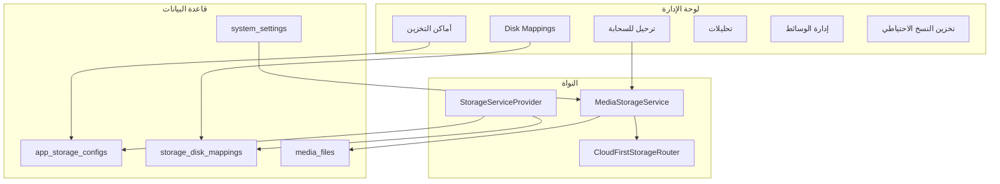

# دليل النقل والميزات الكامل — حزمة التخزين السحابي (cloud)

> **الغرض:** هذا الملف هو المرجع الوحيد لنقل حزمة `cloud/` من مشروع **quantum_lms** إلى أي مشروع Laravel جديد. يشرح الميزات، البنية، خطوات الدمج، الإعدادات، والاستخدام البرمجي.

**المصدر:** `quantum_lms`  
**الإصدار المستهدف:** Laravel ^12.0 | PHP ^8.2  
**عدد الملفات في الحزمة:** ~114 ملف (انظر [MANIFEST.md](MANIFEST.md))

---

## فهرس المحتويات

1. [نظرة عامة](#1-نظرة-عامة)
2. [الميزات بالتفصيل](#2-الميزات-بالتفصيل)
3. [هيكل المجلد cloud](#3-هيكل-المجلد-cloud)
4. [المتطلبات قبل النقل](#4-المتطلبات-قبل-النقل)
5. [خطوات النقل خطوة بخطوة](#5-خطوات-النقل-خطوة-بخطوة)
6. [قاعدة البيانات](#6-قاعدة-البيانات)
7. [المسارات وواجهة الإدارة](#7-المسارات-وواجهة-الإدارة)
8. [الصلاحيات](#8-الصلاحيات)
9. [إعدادات التخزين](#9-إعدادات-التخزين)
10. [أوضاع التخزين (Driver Modes)](#10-أوضاع-التخزين-driver-modes)
11. [مزودو التخزين المدعومون](#11-مزودو-التخزين-المدعومون)
12. [الاستخدام البرمجي](#12-الاستخدام-البرمجي)
13. [أوامر Artisan](#13-أوامر-artisan)
14. [الطوابير (Queue)](#14-الطوابير-queue)
15. [التخصيص للمشروع الجديد](#15-التخصيص-للمشروع-الجديد)
16. [ما لم يُضمَّن في الحزمة](#16-ما-لم-يُضمَّن-في-الحزمة)
17. [استكشاف الأخطاء](#17-استكشاف-الأخطاء)
18. [قائمة تحقق نهائية](#18-قائمة-تحقق-نهائية)

---

## 1. نظرة عامة

حزمة **cloud** تجمع ثلاث وحدات مترابطة:

| الوحدة | الوظيفة الرئيسية |
|--------|------------------|
| **App Storage** | تخزين ملفات التطبيق (صور، فيديو، مرفقات) على S3 وغيره |
| **Backup Storage** | وجهات تخزين ملفات النسخ الاحتياطي (منفصلة عن تخزين التطبيق) |
| **Media** | سجل مركزي للوسائط، مزامنة، تحويلات، مراقبة، dead letters |



---

## 2. الميزات بالتفصيل

### 2.1 تخزين التطبيق (App Storage)

| الميزة | الوصف |
|--------|--------|
| **أماكن التخزين** | إضافة/تعديل/حذف/اختبار اتصال بعدة مزودين سحابيين |
| **تشفير الاعتماد** | مفاتيح API ومعلومات الاتصال مشفّرة في `app_storage_configs.config` |
| **الأولوية والتكرار** | ترتيب الأولوية + خيار redundancy بين مزودين |
| **CDN** | حقل `cdn_url` اختياري لكل مكان تخزين |
| **أنواع الملفات** | تقييد أنواع الملفات المسموحة لكل إعداد |
| **الميزانية والتنبيهات** | `monthly_budget` و `cost_alert_threshold` |
| **Disk Mappings** | ربط اسم قرص منطقي (مثل `images`) بمكان تخزين أساسي + fallbacks |
| **أقراص ديناميكية** | `StorageServiceProvider` يحقن أقراص Flysystem عند التشغيل من DB |
| **تحليلات الاستخدام** | تتبع الحجم، النطاق، التكلفة في `app_storage_analytics` |

**الملفات الرئيسية:**
- `App\Http\Controllers\Admin\AppStorageController`
- `App\Http\Controllers\Admin\AppStorageAnalyticsController`
- `App\Http\Controllers\Admin\StorageDiskMappingController`
- `App\Services\Storage\AppStorageManager`, `AppStorageFactory`, `StorageConfigNormalizer`

---

### 2.2 الترحيل والمزامنة (Migration & Sync)

| الميزة | الوصف |
|--------|--------|
| **تحليل محلي** | فحص الملفات على القرص `public` التي لم تُرفع للسحابة |
| **ترحيل دفعي** | Batch مع تتبع التقدم في `storage_sync_batches` |
| **إلغاء الدفعة** | إيقاف ترحيل قيد التنفيذ |
| **التحقق** | مقارنة وجود الملفات محلياً وسحابياً |
| **التنظيف** | حذف النسخ المحلية بعد نجاح الترحيل (اختياري) |
| **Dead Letter** | تسجيل الفشل الدائم في `storage_sync_dead_letters` |
| **إعادة المحاولة** | exponential backoff عبر `StorageSyncJob` |

**الملفات الرئيسية:**
- `StorageMigrationController`, `StorageMigrationService`, `StorageSyncJob`, `StorageSyncBatch`

**مسارات الترحيل الافتراضية** (قابلة للتعديل في `StorageMigrationService::KNOWN_PATHS`):

| مسار محلي | قرص منطقي |
|-----------|-----------|
| `users/photos` | `avatars` |
| `quizzes`, `questions/images`, … | `images` |
| `lessons/videos` | `videos` |
| `lessons/attachments` | `attachments` |
| `library/items`, `library/thumbnails` | `library` |

---

### 2.3 تخزين النسخ الاحتياطي (Backup Storage)

| الميزة | الوصف |
|--------|--------|
| **وجهات متعددة** | إعداد أماكن لرفع ملفات النسخ الاحتياطي |
| **10 سائقين** | Local, S3, Google Drive, Dropbox, FTP, SFTP, Azure, DO Spaces, Wasabi, Backblaze, Cloudflare R2 |
| **اختبار الاتصال** | من الواجهة أو عبر `backup:test-storage` |
| **تحليلات** | `StorageAnalyticsService` + جدول `storage_analytics` |

> **تنبيه:** نظام **جدولة النسخ** (`Backup`, `BackupSchedule`, `BackupService`) **غير مضمّن** في هذه الحزمة. فقط **وجهات التخزين** للنسخ.

---

### 2.4 نظام الوسائط (Media)

| الميزة | الوصف |
|--------|--------|
| **سجل Media** | جدول `media` + `media_files` لتتبع كل ملف |
| **المتغيرات** | `media_variants` (أحجام/صيغ مختلفة) |
| **التحويلات** | `media_conversions` + jobs (thumbnail, optimize, transcode) |
| **الاستخدامات** | `media_usages` — ربط الملف بكيان (درس، سؤال، …) |
| **المراقبة** | لوحة `media-monitoring` للإحصائيات والتنبيهات |
| **Dead Letters** | واجهة إعادة محاولة فشل المزامنة |
| **الملفات اليتيمة** | كشف وحذف ملفات بلا مرجع |
| **المزامنة الفورية** | زر sync من صفحة تفاصيل الوسيط |

**Jobs:**
- `OptimizeImageJob`, `GenerateThumbnailJob`, `VideoTranscodeJob`, `VirusScanJob`

---

### 2.5 طبقة الرفع الموحدة (MediaStorageService)

| الميزة | الوصف |
|--------|--------|
| رفع صورة/فيديو/مستند/ملف خاص | `uploadImage`, `uploadVideo`, `uploadDocument`, `uploadPrivateFile` |
| منع التكرار | checksum + `media_files` |
| أوضاع متعددة | حسب `storage_driver_mode` (انظر القسم 10) |
| روابط عامة/موقّعة | `url()`, `temporaryUrl()` مع دعم presigned URLs |
| حذف | `delete()` مع محاولة حذف من السحابة واللوكال |
| تسجيل | logging عند تفعيل `storage_log_uploads` |

---

## 3. هيكل المجلد cloud

```
cloud/
├── دليل-النقل-والميزات.md    ← هذا الملف
├── README.md
├── INTEGRATION.md
├── MANIFEST.md
├── app/
│   ├── Console/Commands/       # storage:*, app:storage:test, backup:test-storage
│   ├── Contracts/
│   ├── Enums/StorageDriverMode.php
│   ├── Helpers/StorageHelper.php
│   ├── Http/Controllers/Admin/ # 8 controllers
│   ├── Jobs/StorageSyncJob.php + Jobs/Media/
│   ├── Models/                 # 16 model تقريباً
│   ├── Providers/StorageServiceProvider.php
│   ├── Services/Storage/       # 9 services
│   ├── Services/Backup/        # + StorageDrivers/
│   ├── Services/Media/
│   └── Support/Storage/
├── config/storage.php
├── database/migrations/        # 18 migration
├── database/seeders/CloudPermissionsSeeder.php
├── resources/views/admin/pages/
├── routes/admin-cloud.routes.php
├── integration/                # مقتطفات للدمج اليدوي
└── tests/Unit/                   # 3 tests
```

---

## 4. المتطلبات قبل النقل

### 4.1 حزم Composer

```bash
composer require league/flysystem-aws-s3-v3:^3.30
composer require league/flysystem-azure-blob-storage:^3.30
composer require league/flysystem-ftp:^3.29
composer require league/flysystem-sftp-v3:^3.30
composer require masbug/flysystem-google-drive-ext:^2.4
composer require spatie/flysystem-dropbox:^3.0
composer require spatie/laravel-permission:^6.19
```

### 4.2 تبعيات المشروع المضيف

| التبعية | مطلوب لـ | ملاحظة |
|---------|----------|--------|
| `App\Models\User` | علاقة `uploader` في Media، `created_by` في AppStorageConfig | تأكد من وجود جدول users |
| Middleware `auth` + `admin` | جميع controllers الإدارية | أو عدّل الـ middleware |
| Layout إداري Blade | كل views تحت `admin.pages.*` | عدّل `@extends` إن اختلف المسار |
| `spatie/laravel-permission` | الصلاحيات | أو استبدل بآلية صلاحياتك |
| قرص `public` في filesystems | fallback محلي | `storage/app/public` + `php artisan storage:link` |
| Queue driver | StorageSyncJob + Media jobs | يُفضّل `database` أو `redis` |

### 4.3 متغيرات .env (أمثلة)

```env
APP_KEY=base64:...          # مهم لتشفير credentials
FILESYSTEM_DISK=local
QUEUE_CONNECTION=database

# AWS (مثال)
AWS_ACCESS_KEY_ID=
AWS_SECRET_ACCESS_KEY=
AWS_DEFAULT_REGION=
AWS_BUCKET=
AWS_USE_PATH_STYLE_ENDPOINT=false
```

---

## 5. خطوات النقل خطوة بخطوة

### المرحلة أ — نسخ الملفات

انسخ من `cloud/` إلى جذر المشروع الجديد (**دمج** وليس استبدال كامل):

| من (داخل cloud/) | إلى (المشروع الجديد) |
|------------------|----------------------|
| `app/` | `app/` |
| `config/storage.php` | `config/storage.php` |
| `database/migrations/*` | `database/migrations/` |
| `database/seeders/CloudPermissionsSeeder.php` | `database/seeders/` |
| `resources/views/` | `resources/views/` |
| `tests/Unit/*` | `tests/Unit/` |

```bash
# مثال (Linux/macOS) — عدّل المسارات
cp -r cloud/app/* your-project/app/
cp cloud/config/storage.php your-project/config/
cp cloud/database/migrations/* your-project/database/migrations/
cp cloud/database/seeders/CloudPermissionsSeeder.php your-project/database/seeders/
cp -r cloud/resources/views/* your-project/resources/views/
cp cloud/tests/Unit/* your-project/tests/Unit/
```

### المرحلة ب — تسجيل المزود

في `bootstrap/providers.php`:

```php
return [
    App\Providers\AppServiceProvider::class,
    App\Providers\StorageServiceProvider::class,  // ← أضف هذا السطر
];
```

### المرحلة ج — المسارات

افتح `cloud/routes/admin-cloud.routes.php` وانسخ محتواه داخل مجموعة `Route::prefix('admin')` في `routes/admin.php` (مع middleware `auth` و `admin`).

**مثال هيكل:**

```php
Route::middleware(['auth', 'admin'])->prefix('admin')->name('admin.')->group(function () {
    // ... مساراتك الحالية ...

    // === من admin-cloud.routes.php ===
    require base_path('cloud/routes/admin-cloud.routes.php'); // أو الصق المحتوى مباشرة
});
```

### المرحلة د — Helpers

1. أضف `media_public_url()` من `cloud/integration/helpers.media_public_url.snippet` إلى `app/helpers.php`.
2. أضف `storage_disk()` من `cloud/integration/AppServiceProvider.storage_disk.snippet` داخل `AppServiceProvider::boot()`.
3. في `composer.json`:

```json
"autoload": {
    "files": ["app/helpers.php"]
}
```

ثم: `composer dump-autoload`

### المرحلة هـ — قاعدة البيانات

```bash
php artisan migrate
php artisan db:seed --class=CloudPermissionsSeeder
```

### المرحلة و — واجهة الإدارة

1. **القائمة الجانبية:** ادمج `cloud/integration/sidebar-storage.blade.snippet` في `main-sidebar.blade.php`.
2. **صفحة الإعدادات:** ادمج `cloud/integration/settings-storage.blade.snippet` في صفحة الإعدادات، وتأكد من عرض مجموعة `group = storage`.

### المرحلة ز — الطوابير

```bash
php artisan queue:table
php artisan migrate
php artisan queue:work --queue=storage-sync,default
```

(أو استخدم Supervisor في الإنتاج — انظر القسم 14)

### المرحلة ح — الصلاحيات

عيّن للأدوار الإدارية:
- `settings-manage` (للوصول لقوائم التخزين والترحيل)
- `app-storage-*`, `backup-storage-*`, `storage-disk-mapping-*` حسب الحاجة

---

## 6. قاعدة البيانات

### 6.1 الجداول التي تُنشئها migrations الحزمة

| الجدول | الغرض |
|--------|--------|
| `system_settings` | إعدادات runtime (مجموعة storage) |
| `app_storage_configs` | أماكن التخزين السحابي |
| `app_storage_analytics` | إحصائيات الاستخدام لكل مكان |
| `storage_disk_mappings` | ربط الأقراص المنطقية بالتخزين |
| `storage_sync_batches` | دفعات الترحيل |
| `storage_sync_dead_letters` | فشل المزامنة الدائم |
| `backup_storage_configs` | وجهات نسخ احتياطي |
| `storage_analytics` | تحليلات تخزين النسخ |
| `media` | سجل الوسائط الرئيسي |
| `media_files` | تفاصيل الملف والمزامنة |
| `media_variants` | متغيرات الحجم/الصيغة |
| `media_conversions` | مهام التحويل |
| `media_usages` | ربط الوسيط بكيان |
| `media_metrics` | مقاييس الأداء |

### 6.2 ترتيب migrations

شغّل `php artisan migrate` — Laravel يرتّب حسب التاريخ في اسم الملف. تأكد أن `create_system_settings_table` يعمل قبل `add_storage_runtime_settings`.

---

## 7. المسارات وواجهة الإدارة

افترض البادئة: `/admin` واسم المسار `admin.*`

### 7.1 تخزين التطبيق

| المسار | الاسم | الوظيفة |
|--------|-------|---------|
| `GET /admin/app-storage/configs` | `admin.app-storage.configs.index` | قائمة أماكن التخزين |
| `GET /admin/app-storage/configs/create` | `admin.app-storage.configs.create` | إضافة مكان |
| `POST /admin/app-storage/configs` | `admin.app-storage.configs.store` | حفظ |
| `GET /admin/app-storage/configs/{config}/edit` | `admin.app-storage.configs.edit` | تعديل |
| `POST /admin/app-storage/configs/{config}/test` | `admin.app-storage.configs.test` | اختبار اتصال |
| `GET /admin/app-storage/analytics` | `admin.app-storage.analytics` | تحليلات |

### 7.2 Disk Mappings

| المسار | الوظيفة |
|--------|---------|
| `GET /admin/storage-disk-mappings` | قائمة الربط |
| CRUD كامل | إنشاء/تعديل/حذف mapping |

### 7.3 الترحيل

| المسار | الوظيفة |
|--------|---------|
| `GET /admin/storage-migration` | لوحة الترحيل |
| `GET /admin/storage-migration/analyze/{disk?}` | تحليل الملفات المحلية |
| `POST /admin/storage-migration/migrate` | بدء ترحيل قرص |
| `POST /admin/storage-migration/migrate-all` | ترحيل الكل |
| `GET /admin/storage-migration/batch/{batchId}` | حالة الدفعة |
| `POST /admin/storage-migration/batch/{batchId}/cancel` | إلغاء |
| `GET /admin/storage-migration/verify/{diskName}` | تحقق |
| `POST /admin/storage-migration/cleanup/{diskName}` | تنظيف محلي |

### 7.4 الوسائط

| المسار | الوظيفة |
|--------|---------|
| `GET /admin/media` | قائمة الوسائط |
| `GET /admin/media/dead-letters` | فشل المزامنة |
| `GET /admin/media/conversions` | التحويلات |
| `GET /admin/media/orphans` | ملفات يتيمة |
| `GET /admin/media-monitoring` | لوحة المراقبة |
| `POST /admin/media/{medium}/sync` | مزامنة فورية |

### 7.5 تخزين النسخ الاحتياطي

| المسار | الوظيفة |
|--------|---------|
| `GET /admin/backup-storage` | قائمة الوجهات |
| `GET /admin/backup-storage/analytics` | تحليلات |
| `POST /admin/backup-storage/{config}/test` | اختبار |

---

## 8. الصلاحيات

يُنشئها `CloudPermissionsSeeder`:

| الصلاحية | الوصف |
|----------|--------|
| `app-storage-list` | عرض أماكن التخزين |
| `app-storage-create` | إنشاء |
| `app-storage-edit` | تعديل |
| `app-storage-delete` | حذف |
| `storage-disk-mapping-list` | عرض mappings |
| `storage-disk-mapping-create` | إنشاء mapping |
| `storage-disk-mapping-edit` | تعديل |
| `storage-disk-mapping-delete` | حذف |
| `backup-storage-list` | عرض تخزين النسخ |
| `backup-storage-create` | إنشاء |
| `backup-storage-edit` | تعديل |
| `backup-storage-delete` | حذف |
| `backup-storage-test` | اختبار |
| `backup-storage-test-connection` | اختبار اتصال |

**ملاحظة:** الترحيل والتحليلات غالباً تتطلب `settings-manage` في الواجهة (من القائمة الجانبية).

```bash
php artisan db:seed --class=CloudPermissionsSeeder
```

---

## 9. إعدادات التخزين

### 9.1 ملف config/storage.php

| المفتاح | الافتراضي | الوصف |
|---------|-----------|--------|
| `runtime_from_database` | `true` | دمج إعدادات DB عند التشغيل |
| `driver_mode` | `cloud_first` | يُستبدل من `system_settings` |
| `fallback_disk` | `public` | القرص المحلي الاحتياطي |
| `media_use_presigned_urls` | `true` | روابط موقّعة لـ S3 الخاص |
| `max_file_size` | 500 MB | حد الرفع |
| `sync_queue` | `storage-sync` | اسم الطابور |
| `sync_retries` | 3 | إعادات المحاولة |
| `disk_map` | avatars→images, … | خريطة الأقراص المنطقية |

### 9.2 إعدادات system_settings (مجموعة storage)

تُضاف تلقائياً عبر migration `2026_05_12_120000_*`:

| المفتاح | النوع | الوصف |
|---------|-------|--------|
| `storage_driver_mode` | string | وضع التخزين (انظر القسم 10) |
| `storage_fallback_disk` | string | قرص Laravel المحلي |
| `storage_sync_queue` | string | اسم الطابور |
| `storage_sync_retries` | integer | عدد المحاولات |
| `storage_sync_backoff_seconds` | integer | تأخير backoff |
| `storage_max_upload_size_mb` | integer | حد الرفع MB |
| `storage_deduplication_enabled` | boolean | منع التكرار |
| `storage_auto_generate_thumbnails` | boolean | مصغّرات تلقائية |
| `storage_auto_optimize_images` | boolean | تحسين صور |
| `storage_retention_days` | integer | احتفاظ بالحذف الناعم |

إعداد إضافي: `storage_media_presigned_urls` (migration `2026_05_12_160000_*`)

---

## 10. أوضاع التخزين (Driver Modes)

| الوضع | السلوك |
|-------|--------|
| `local_only` | رفع وقراءة من القرص المحلي فقط |
| `cloud_only` | سحابة فقط — فشل الرفع إن لم تتوفر السحابة |
| `cloud_first` | محاولة السحابة أولاً، ثم اللوكال عند الفشل |
| `local_first` | اللوكال أولاً + مزامنة للسحابة عبر Queue |
| `dual_write` | كتابة على اللوكال والسحابة معاً |

يُحدَّد من: **الإعدادات → مجموعة التخزين → storage_driver_mode**

---

## 11. مزودو التخزين المدعومون

### App Storage (`AppStorageConfig::DRIVERS`)

| المفتاح | الاسم |
|---------|-------|
| `local` | Local Storage |
| `s3` | Amazon S3 |
| `google_drive` | Google Drive |
| `dropbox` | Dropbox |
| `ftp` | FTP |
| `sftp` | SFTP |
| `azure` | Azure Blob |
| `digitalocean` | DigitalOcean Spaces |
| `wasabi` | Wasabi |
| `backblaze` | Backblaze B2 |
| `cloudflare_r2` | Cloudflare R2 |

### Backup Storage (StorageDrivers)

نفس المزودين تقريباً عبر `app/Services/Backup/StorageDrivers/*`

---

## 12. الاستخدام البرمجي

### 12.1 رفع ملف

```php
use App\Services\Storage\MediaStorageService;
use Illuminate\Http\UploadedFile;

/** @var UploadedFile $file */
$result = MediaStorageService::uploadImage($file, 'products/images');

if ($result['success']) {
    $path = $result['path'];           // products/images/xxx.jpg
    $url  = $result['url'];            // رابط للعرض
    $disk = $result['disk'] ?? null;   // القرص المنطقي
}
```

### 12.2 عرض رابط في Blade

```blade
image_path) }}" alt="">
```

### 12.3 حذف ملف

```php
MediaStorageService::delete('products/images/photo.jpg');
```

### 12.4 قرص تخزين مباشر (legacy)

```php
use App\Helpers\StorageHelper;

$disk = StorageHelper::disk('images');
$disk->put('folder/file.jpg', $contents);
```

أو عبر helper في `AppServiceProvider`:

```php
storage_disk('images')->put('path', $contents);
```

### 12.5 رابط مؤقت (خاص)

```php
$url = MediaStorageService::temporaryUrl($path, minutes: 30);
```

### 12.6 مزامنة يدوية للسحابة

```php
use App\Jobs\StorageSyncJob;

StorageSyncJob::dispatch('users/photos/avatar.jpg', 'avatars', batchId: null);
```

---

## 13. أوامر Artisan

| الأمر | الوصف |
|-------|--------|
| `php artisan storage:analyze {disk?}` | تحليل الملفات المحلية القابلة للترحيل |
| `php artisan storage:migrate {--disk=} {--delete-local}` | بدء ترحيل (batch) |
| `php artisan storage:migrate-cleanup {disk}` | تنظيف بعد الترحيل |
| `php artisan app:storage:test {disk?}` | اختبار اتصال app storage |
| `php artisan backup:test-storage {config?}` | اختبار backup storage |

**أمثلة:**

```bash
php artisan storage:analyze
php artisan storage:analyze images
php artisan storage:migrate --disk=images
php artisan app:storage:test images
php artisan backup:test-storage 1
```

---

## 14. الطوابير (Queue)

### 14.1 الإعداد

```env
QUEUE_CONNECTION=database
```

```bash
php artisan queue:table
php artisan migrate
```

### 14.2 تشغيل Worker

```bash
php artisan queue:work --queue=storage-sync,default --tries=3
```

### 14.3 Supervisor (إنتاج)

```ini
[program:laravel-worker]
process_name=%(program_name)s_%(process_num)02d
command=php /path/to/artisan queue:work --sleep=3 --tries=3 --queue=storage-sync,default
autostart=true
autorestart=true
user=www-data
numprocs=2
redirect_stderr=true
stdout_logfile=/path/to/worker.log
```

### 14.4 Jobs التي تعتمد على Queue

- `App\Jobs\StorageSyncJob` — مزامنة ملف للسحابة
- `App\Jobs\Media\GenerateThumbnailJob`
- `App\Jobs\Media\OptimizeImageJob`
- `App\Jobs\Media\VideoTranscodeJob`
- `App\Jobs\Media\VirusScanJob`

---

## 15. التخصيص للمشروع الجديد

### 15.1 مسارات الترحيل

عدّل في `app/Services/Storage/StorageMigrationService.php`:

```php
private const KNOWN_PATHS = [
    'uploads/images' => 'images',
    'uploads/docs'   => 'documents',
    // ...
];
```

وأيضاً `CloudFirstStorageRouter::LOCAL_PATHS` إن وُجد.

### 15.2 خريطة الأقراص disk_map

في `config/storage.php`:

```php
'disk_map' => [
    'avatars' => 'images',
    'products' => 'images',
],
```

### 15.3 Layouts الـ Blade

Views تستخدم مسارات مثل:

```blade
@extends('admin.layouts.app')
```

عدّل جميع ملفات `resources/views/admin/pages/app-storage/` وغيرها لتطابق layout مشروعك.

### 15.4 Middleware

Controllers تستخدم:

```php
$this->middleware(['auth', 'admin']);
```

استبدل `admin` بـ middleware مشروعك.

### 15.5 نموذج User

تأكد من:

```php
// App\Models\Media
public function uploader(): BelongsTo
{
    return $this->belongsTo(User::class, 'uploaded_by');
}
```

### 15.6 تشفير Credentials

بيانات `config` في `AppStorageConfig` و `BackupStorageConfig` مشفّرة بـ `APP_KEY`.

- عند نقل DB فقط دون نفس `APP_KEY` → **أعد إدخال** مفاتيح API من لوحة الإدارة.
- لا تنقل `.env` بين بيئات إنتاج مختلفة دون فهم التبعات.

---

## 16. ما لم يُضمَّن في الحزمة

| غير مضمّن | السبب |
|-----------|--------|
| `BackupController`, `BackupSchedule`, `BackupService` | نظام النسخ الكامل منفصل |
| Controllers LMS (`QuestionController`, `LessonController`, …) | مستهلكون فقط — استخدم `MediaStorageService` |
| Filament | غير مستخدم في المصدر |
| `vendor/` | تثبيت عبر Composer |
| تخطيط admin كامل | فقط مقتطفات sidebar |

---

## 17. استكشاف الأخطاء

| المشكلة | الحل المحتمل |
|---------|--------------|
| الصور لا تظهر (404) | `php artisan storage:link` — تحقق من `media_public_url` و presigned URLs |
| فشل الرفع السحابي | `php artisan app:storage:test` — تحقق من Disk Mapping نشط |
| الترحيل لا يتقدم | تأكد من تشغيل `queue:work` على `storage-sync` |
| Dead letters تتراكم | راجع `storage_sync_dead_letters` — أعد المحاولة من `/admin/media/dead-letters` |
| إعدادات لا تُطبَّق | `runtime_from_database=true` — تحقق من `system_settings` مجموعة storage |
| خطأ تشفير config | أعد حفظ مكان التخزين بعد ضبط `APP_KEY` |
| Class User not found | أضف model User أو عدّل العلاقات في Media |
| صفحة بيضاء بعد الدمج | تحقق من `@extends` ومسارات views |

---

## 18. قائمة تحقق نهائية

- [ ] نسخ `cloud/app`, `config`, `database`, `resources`, `tests`
- [ ] `composer require` لحزم Flysystem
- [ ] تسجيل `StorageServiceProvider`
- [ ] دمج `admin-cloud.routes.php`
- [ ] `composer dump-autoload` بعد helpers
- [ ] `php artisan migrate`
- [ ] `php artisan db:seed --class=CloudPermissionsSeeder`
- [ ] دمج sidebar + settings snippets
- [ ] `php artisan storage:link`
- [ ] إعداد Queue + Supervisor
- [ ] إنشاء مكان تخزين S3 (أو غيره) + Disk Mapping
- [ ] اختبار: `app:storage:test` + رفع ملف من الكود
- [ ] تعديل `KNOWN_PATHS` لمشروعك
- [ ] تعيين الصلاحيات للأدوار

---

## ملفات مساعدة في الحزمة

| الملف | الاستخدام |
|-------|-----------|
| [routes/admin-cloud.routes.php](routes/admin-cloud.routes.php) | مسارات جاهزة |
| [integration/sidebar-storage.blade.snippet](integration/sidebar-storage.blade.snippet) | القائمة الجانبية |
| [integration/settings-storage.blade.snippet](integration/settings-storage.blade.snippet) | صفحة الإعدادات |
| [integration/helpers.media_public_url.snippet](integration/helpers.media_public_url.snippet) | دالة الروابط |
| [MANIFEST.md](MANIFEST.md) | قائمة الملفات |

---

*آخر تحديث: حزمة مستخرجة من quantum_lms — للأسئلة راجع الكود المصدر في `app/Services/Storage/`.*
